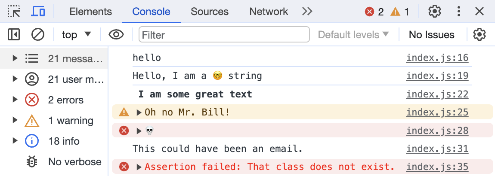

# Dev Tricks

## Description

This is the ninth exercise in the Wes Bos JavaScript 30 challenge. It covers different ways to use the console to help debug code.

- My motivation was to continue to build my skillset
- This exercise was surprisingly exciting to me as I'm a very visual person and being able to differentiate the appearance of console logs makes it more readable for me.
- I particularly liked the idea of assertions to avoid lengthy if statements for console logs.

## Usage

The page will load with two paragraphs. You can click the first one to change the font. The second one instructs you to view the console.

[Live Tricks Page](https://katemcro.github.io/devTricksJS30_09/)

## Credits

This project is from Wes Bos' free [#JavaScript30](https://javascript30.com/) coding challenge.
